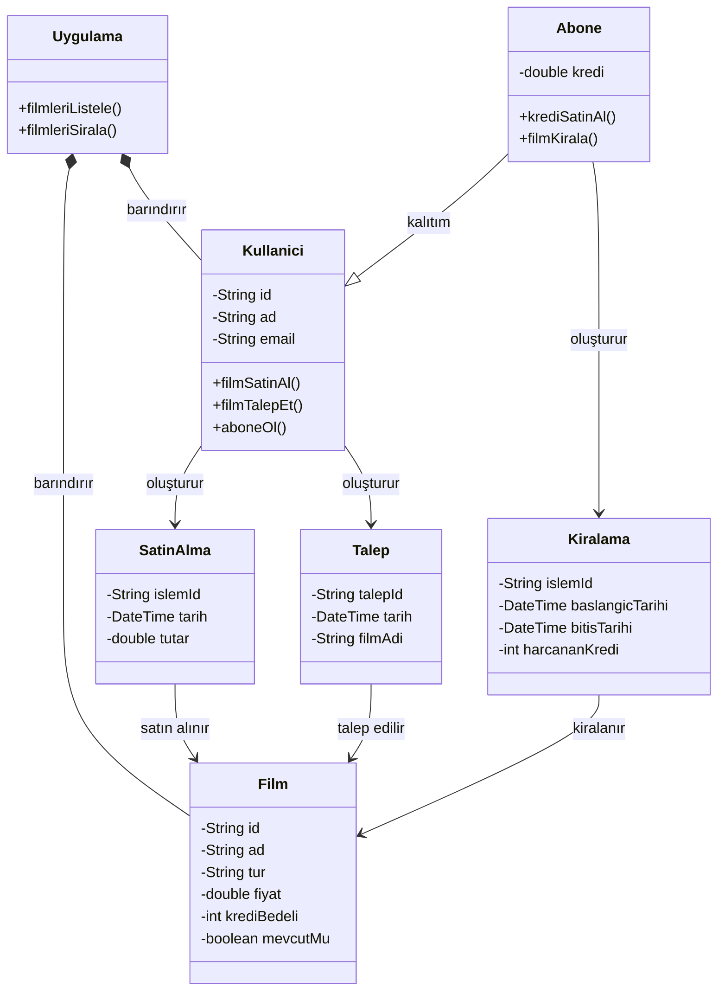

# online-film-sistemi
OOP - Online Film Sistemi 

Uygulamada filmler listelenebilir, sıralanabilir ve kullanıcılar uygulamaya abone olabilir. 
Kullanıcılar abonelik için sistem üzerinden kredi satın alır. 
Sadece abone olan kullanıcılar, kredileri ile film kiralayabilir ve kiraladığı filmin kredi bedeli kadar hesabından düşülür. 
Normal kullanıcılar ve aboneler film satın alabilirler. 
Eğer film mevcut değil ise talep edilebilir.  

Polimorfizm notu: Abone, Kullanici'dan türediği için filmSatinAl() metodunu miras alır. Ek olarak filmKirala() ve krediSatinAl() davranışlarına sahiptir.
